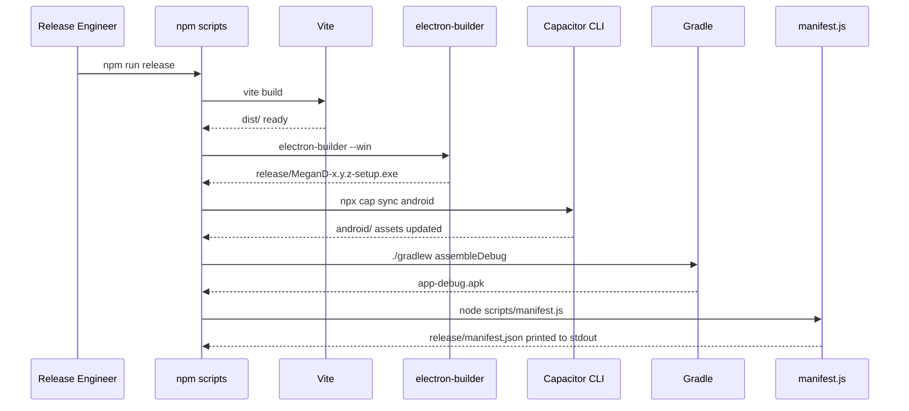

# Design Document — desktop-mobile-packaging

## Overview

This feature adds two distribution targets to the Megan_D Security Operations Platform without touching the existing React/TypeScript source. The Vite production build (`dist/`) becomes the shared web asset that both wrappers embed:

- **Electron** hosts `dist/` in a `BrowserWindow` and electron-builder packages it into a Windows NSIS `.exe` installer.
- **Capacitor** copies `dist/` into an Android Gradle project's web-assets directory and Gradle assembles a debug `.apk`.

A thin orchestration layer (npm scripts + a Node.js manifest script) sequences the steps, collects both artifacts into `release/`, and writes a `manifest.json` with checksums and metadata.

The guiding constraint is **zero source modification**: `src/`, `App.tsx`, all context providers, and all pages remain untouched. Every new file lives outside `src/` at the project root or in dedicated subdirectories (`electron/`, `android/`, `release/`, `scripts/`).

---

## Architecture

### High-Level Pipeline

```mermaid
flowchart TD
    A[npm run build\nvite build] --> B[dist/]
    B --> C[Electron path]
    B --> D[Capacitor path]

    C --> E[electron/main.js\nloads dist/index.html]
    E --> F[npm run package:desktop\nelectron-builder --win]
    F --> G[release/MeganD-x.y.z-setup.exe]

    D --> H[npx cap sync android\ncopies dist/ → android assets]
    H --> I[npm run build:android\n./gradlew assembleDebug]
    I --> J[android/app/build/outputs/apk/debug/app-debug.apk]
    J --> K[copy to release/MeganD-x.y.z-debug.apk]

    G --> L[scripts/manifest.js\nSHA-256 + metadata]
    K --> L
    L --> M[release/manifest.json]

    subgraph CI ["GitHub Actions — on push: tags: v*.*.*"]
        direction TB
        T[git push tag\nv*.*.*] --> P1[build-desktop\nwindows-latest]
        T --> P2[build-android\nubuntu-latest]
        P1 --> P3[publish-release\nubuntu-latest]
        P2 --> P3
        P3 --> R[GitHub Release\nMeganD-{v}-setup.exe\nMeganD-{v}-debug.apk\nmanifest.json]
    end
```

### Packaging Pipeline Sequence



### Separation of Concerns

| Layer | Responsibility | Files |
|---|---|---|
| Web bundle | Compile React/TS → static assets | `vite.config.ts` (adjusted), `dist/` |
| Desktop wrapper | Host web bundle in native window | `electron/main.js`, `electron/preload.js` |
| Desktop packaging | Produce `.exe` installer | `electron-builder` config in `package.json` |
| Mobile wrapper | Sync web bundle into Android project | `capacitor.config.ts`, `android/` |
| Mobile build | Compile Android project → APK | Gradle wrapper in `android/` |
| Orchestration | Sequence all steps, collect artifacts | npm scripts in `package.json` |
| Delivery | Collect artifacts, write manifest | `scripts/manifest.js`, `release/` |
| Smoke tests | Verify launch on both platforms | `tests/smoke/desktop.spec.ts`, `tests/smoke/android.spec.ts` |

---

## Components and Interfaces

### 1. Vite Configuration Adjustments (`vite.config.ts`)

Two changes are required for Electron and Capacitor compatibility:

**a) `base: './'`** — Electron loads `dist/index.html` via `loadFile` (a `file://` URL). All asset references in the emitted HTML must be relative, not absolute (`/assets/...`). Setting `base: './'` ensures Vite emits `./assets/...` paths.

**b) `sourcemap: false`** — Requirement 1.6 prohibits `.map` files in `dist/`. Vite's default in production is already `false`, but this must be explicit to prevent accidental override.

**c) No other changes** — The existing Vite config (inferred to be minimal given the project structure) needs no plugin additions, no entry-point changes, and no alias modifications. Capacitor's sync command handles asset copying independently of Vite's output format.

```ts
// vite.config.ts — additions only
export default defineConfig({
  base: './',          // required for Electron file:// loading and Capacitor WebView
  build: {
    sourcemap: false,  // Req 1.6 — no .map files in dist/
    outDir: 'dist',
  },
  // ... existing plugins (React, etc.) unchanged
})
```

### 2. Electron Main Process (`electron/main.js`)

The main process is a plain CommonJS module (not TypeScript) to avoid a separate transpilation step for the Electron layer.

**Responsibilities:**
- Create and configure the `BrowserWindow`
- Load `dist/index.html` via `loadFile`
- Guard against missing build output
- Handle `window-all-closed` to exit cleanly

**Interface:**

```js
// electron/main.js
const { app, BrowserWindow, dialog } = require('electron')
const path = require('path')
const fs = require('fs')

const DIST_INDEX = path.join(__dirname, '..', 'dist', 'index.html')
const MIN_WIDTH = 1024
const MIN_HEIGHT = 768

function createWindow() {
  // Guard: Req 3.6
  if (!fs.existsSync(DIST_INDEX)) {
    // show modal error dialog, then exit non-zero
  }

  const win = new BrowserWindow({
    width: 1280,
    height: 800,
    minWidth: MIN_WIDTH,       // Req 3.2
    minHeight: MIN_HEIGHT,     // Req 3.2
    webPreferences: {
      nodeIntegration: false,  // Req 3.5
      contextIsolation: true,  // Req 3.5
      preload: path.join(__dirname, 'preload.js'),
    },
  })

  win.loadFile(DIST_INDEX)    // Req 3.1
}

app.whenReady().then(createWindow)

app.on('window-all-closed', () => {  // Req 3.4
  app.quit()
})
```

**Security rationale for `nodeIntegration: false` + `contextIsolation: true`:** The renderer (the React app) must not have access to Node.js APIs. Since the app has no IPC requirements (all async ops are simulated with `setTimeout`/`Promise`), no preload script needs to expose any Node API. The preload file is included as a stub to satisfy electron-builder's packaging expectations and to allow future IPC additions without architectural changes.

### 3. Electron Preload Script (`electron/preload.js`)

Minimal stub — exposes nothing to the renderer. Present to satisfy the `preload` path in `BrowserWindow` config and to provide a safe extension point.

```js
// electron/preload.js
// contextBridge intentionally exposes no APIs.
// All app logic is self-contained in the React bundle.
const { contextBridge } = require('electron')
contextBridge.exposeInMainWorld('electronAPI', {})
```

### 4. electron-builder Configuration (in `package.json`)

Configured as a `"build"` key in `package.json` to keep all packaging metadata in one file.

```json
"build": {
  "appId": "com.megand.secops",
  "productName": "Megan_D",
  "copyright": "Copyright © 2024",
  "directories": {
    "output": "release"
  },
  "files": [
    "dist/**/*",
    "electron/**/*",
    "package.json"
  ],
  "win": {
    "target": "nsis",
    "artifactName": "MeganD-${version}-setup.exe"
  },
  "nsis": {
    "oneClick": false,
    "allowToChangeInstallationDirectory": true
  }
}
```

Key decisions:
- `"output": "release"` — satisfies Req 4.1 and Req 8.1
- `artifactName` pattern — satisfies Req 8.3
- `files` array explicitly includes `dist/` and `electron/` — satisfies Req 4.3
- No `publish` key — unsigned build by default, electron-builder emits a warning automatically (Req 4.5)

### 5. Capacitor Configuration (`capacitor.config.ts`)

```ts
// capacitor.config.ts — project root
import type { CapacitorConfig } from '@capacitor/cli'

const config: CapacitorConfig = {
  appId: 'com.megand.secops',   // Req 5.1
  appName: 'Megan_D',           // Req 5.1
  webDir: 'dist',               // points Capacitor at Vite output
  server: {
    androidScheme: 'https',     // avoids mixed-content issues in WebView
  },
  android: {
    minSdkVersion: 24,          // Req 6.5 — Android 7.0+
  },
}

export default config
```

`webDir: 'dist'` tells `npx cap sync` where to find the web assets to copy into `android/app/src/main/assets/public/` (Req 5.2).

`androidScheme: 'https'` ensures the WebView loads assets under an `https://` scheme rather than `file://`, which prevents Content Security Policy issues with Tailwind's inline styles and avoids mixed-content warnings (Req 5.4).

### 6. Android Gradle Configuration

The `android/` directory is generated by `npx cap add android`. The only manual change required is confirming `minSdkVersion` in `android/variables.gradle`:

```gradle
// android/variables.gradle
ext {
    minSdkVersion = 24      // Req 6.5
    compileSdkVersion = 34
    targetSdkVersion = 34
    // ... Capacitor defaults for other vars
}
```

No other Gradle modifications are needed — Capacitor's `add android` command generates a working project with correct WebView configuration for the `https` scheme set in `capacitor.config.ts`.

### 7. npm Script Orchestration (`package.json` scripts)

```json
"scripts": {
  "dev": "vite",
  "build": "vite build",
  "preview": "vite preview",

  "electron:dev": "npm run build && electron .",
  "package:desktop": "npm run build && electron-builder --win",

  "cap:sync": "npm run build && npx cap sync android",
  "build:android": "npm run cap:sync && cd android && ./gradlew assembleDebug",

  "release": "npm run package:desktop && npm run build:android && node scripts/collect-artifacts.js && node scripts/manifest.js",

  "test:smoke:desktop": "playwright test tests/smoke/desktop.spec.ts",
  "test:smoke:android": "npx wdio tests/smoke/android.spec.ts"
}
```

**Sequencing rationale:**
- `package:desktop` always runs `build` first — prevents Req 4.6 failure in normal usage
- `cap:sync` always runs `build` first — prevents Req 5.6 failure in normal usage
- `release` chains desktop → android → collect → manifest in dependency order
- Individual steps remain independently invocable for CI flexibility

### 8. Artifact Collection Script (`scripts/collect-artifacts.js`)

Copies the APK from Gradle's output directory into `release/` and renames it to the manifest pattern.

```js
// scripts/collect-artifacts.js
const fs = require('fs')
const path = require('path')
const { version } = require('../package.json')

const APK_SRC = path.resolve('android/app/build/outputs/apk/debug/app-debug.apk')
const APK_DEST = path.resolve(`release/MeganD-${version}-debug.apk`)

fs.mkdirSync('release', { recursive: true })
fs.copyFileSync(APK_SRC, APK_DEST)
console.log(`Copied APK → ${APK_DEST}`)
```

### 9. Manifest Script (`scripts/manifest.js`)

```js
// scripts/manifest.js
const fs = require('fs')
const crypto = require('crypto')
const path = require('path')
const { version } = require('../package.json')

function artifactEntry(filePath) {
  if (!fs.existsSync(filePath)) {
    return { filename: path.basename(filePath), status: 'failed' }  // Req 8.4
  }
  const buf = fs.readFileSync(filePath)
  return {
    filename: path.basename(filePath),
    size: buf.length,
    sha256: crypto.createHash('sha256').update(buf).digest('hex'),
    status: 'success',
  }
}

const manifest = {
  version,
  buildTimestamp: new Date().toISOString(),   // ISO 8601 UTC — Req 8.2
  artifacts: [
    artifactEntry(path.resolve(`release/MeganD-${version}-setup.exe`)),
    artifactEntry(path.resolve(`release/MeganD-${version}-debug.apk`)),
  ],
}

const json = JSON.stringify(manifest, null, 2)
fs.writeFileSync('release/manifest.json', json)
console.log(json)   // Req 8.5 — print to stdout
```

---

## Data Models

### `release/manifest.json` Schema

```ts
interface ManifestArtifact {
  filename: string           // e.g. "MeganD-1.0.0-setup.exe"
  size?: number              // bytes; absent when status is "failed"
  sha256?: string            // hex string; absent when status is "failed"
  status: 'success' | 'failed'
}

interface ReleaseManifest {
  version: string            // from package.json "version"
  buildTimestamp: string     // ISO 8601 UTC, e.g. "2024-01-15T10:30:00.000Z"
  artifacts: ManifestArtifact[]
}
```

Example output:

```json
{
  "version": "1.0.0",
  "buildTimestamp": "2024-01-15T10:30:00.000Z",
  "artifacts": [
    {
      "filename": "MeganD-1.0.0-setup.exe",
      "size": 87654321,
      "sha256": "a3f1c2...",
      "status": "success"
    },
    {
      "filename": "MeganD-1.0.0-debug.apk",
      "size": 12345678,
      "sha256": "b9e4d1...",
      "status": "success"
    }
  ]
}
```

### Project Directory Structure (after packaging setup)

```
<project-root>/          ← parent of src/; all config files live here
├── .github/
│   └── workflows/
│       └── release.yml  ← GitHub Actions CI/CD release workflow
├── src/                 ← UNCHANGED — existing React/TS source
├── dist/                ← Vite build output (gitignored)
├── electron/
│   ├── main.js          ← Electron main process
│   └── preload.js       ← Context bridge stub
├── android/             ← Generated by `npx cap add android` (gitignored)
├── release/             ← Collected artifacts (gitignored)
│   ├── MeganD-{v}-setup.exe
│   ├── MeganD-{v}-debug.apk
│   └── manifest.json
├── scripts/
│   ├── collect-artifacts.js
│   └── manifest.js
├── tests/
│   └── smoke/
│       ├── desktop.spec.ts
│       └── android.spec.ts
├── capacitor.config.ts
├── vite.config.ts       ← base: './' and sourcemap: false added
└── package.json         ← new scripts + electron-builder "build" config
```

### 10. GitHub Actions Release Workflow (`.github/workflows/release.yml`)

The workflow automates the full release pipeline on every semver version tag push. It runs two build jobs in parallel and a final publish job that depends on both.

#### Trigger

```yaml
on:
  push:
    tags:
      - 'v*.*.*'
```

The workflow fires **only** when a tag matching `v*.*.*` is pushed. Branch pushes, pull request events, and non-version tags do not trigger it (Req 9.2).

#### Job 1: `build-desktop` (`windows-latest`)

Builds the Windows `.exe` installer and uploads it as a workflow artifact.

```yaml
build-desktop:
  runs-on: windows-latest
  steps:
    - uses: actions/checkout@v4

    - uses: actions/setup-node@v4
      with:
        node-version-file: '.nvmrc'   # or hardcoded to project Node version

    - run: npm ci

    - run: npm run package:desktop
      # produces release/MeganD-{version}-setup.exe

    - uses: actions/upload-artifact@v4
      with:
        name: desktop-installer
        path: release/MeganD-*-setup.exe
```

`npm run package:desktop` runs `vite build` then `electron-builder --win`, so the full build-and-package sequence is encapsulated in the existing npm script (Req 9.3).

#### Job 2: `build-android` (`ubuntu-latest`)

Builds the Android debug `.apk` and uploads it as a workflow artifact.

```yaml
build-android:
  runs-on: ubuntu-latest
  steps:
    - uses: actions/checkout@v4

    - uses: actions/setup-node@v4
      with:
        node-version-file: '.nvmrc'

    - uses: actions/setup-java@v4
      with:
        distribution: temurin
        java-version: '17'

    - run: npm ci

    - run: npm run cap:sync
      # runs vite build then npx cap sync android

    - run: node scripts/build-android.js
      # invokes ./gradlew assembleDebug inside android/

    - run: node scripts/collect-artifacts.js
      # copies app-debug.apk → release/MeganD-{version}-debug.apk

    - uses: actions/upload-artifact@v4
      with:
        name: android-apk
        path: release/MeganD-*-debug.apk
```

The `ubuntu-latest` runner includes the Android SDK. `actions/setup-java` with the `temurin` distribution provides JDK 17, satisfying the Gradle build requirements (Req 9.4).

**Why a separate `scripts/build-android.js`?** The Gradle wrapper (`./gradlew`) must be invoked from inside the `android/` directory. A thin Node script handles the `cwd` change and the 300-second timeout (Req 6.6) in a cross-platform way, keeping the workflow YAML clean.

#### Job 3: `publish-release` (`ubuntu-latest`)

Downloads both artifacts, generates the manifest, creates the GitHub Release, and attaches all three files.

```yaml
publish-release:
  runs-on: ubuntu-latest
  needs: [build-desktop, build-android]
  steps:
    - uses: actions/checkout@v4

    - uses: actions/download-artifact@v4
      with:
        name: desktop-installer
        path: release/

    - uses: actions/download-artifact@v4
      with:
        name: android-apk
        path: release/

    - run: node scripts/manifest.js
      # generates release/manifest.json and prints it to stdout

    - uses: softprops/action-gh-release@v2
      with:
        tag_name: ${{ github.ref_name }}
        name: Megan_D ${{ github.ref_name }}
        body_path: release/manifest.json
        files: |
          release/MeganD-*-setup.exe
          release/MeganD-*-debug.apk
          release/manifest.json
        token: ${{ secrets.GITHUB_TOKEN }}
```

`needs: [build-desktop, build-android]` means this job is skipped automatically if either upstream job fails — no explicit failure-handling logic is required (Req 9.10). The workflow run summary will show the failed job name and its exit code via GitHub Actions' built-in job status reporting.

`GITHUB_TOKEN` is the automatically-provisioned secret available in every GitHub Actions run. No additional secrets or manually configured credentials are needed for unsigned builds (Req 9.8).

#### Download URL Pattern

After `publish-release` completes, the release assets are available at:

```
https://github.com/{owner}/{repo}/releases/download/{tag}/MeganD-{version}-setup.exe
https://github.com/{owner}/{repo}/releases/download/{tag}/MeganD-{version}-debug.apk
```

This matches the GitHub Releases asset URL pattern required by Req 9.9.

#### Failure Handling

| Failure scenario | Behaviour |
|---|---|
| `build-desktop` fails | `publish-release` is skipped; `build-android` continues independently |
| `build-android` fails | `publish-release` is skipped; `build-desktop` continues independently |
| Both build jobs fail | `publish-release` is skipped |
| `publish-release` fails | GitHub Release is not created; artifacts remain as workflow artifacts for 90 days |

GitHub Actions surfaces the failed job name and exit code in the workflow run summary automatically — no custom reporting step is needed (Req 9.10).

#### Complete Workflow File

```yaml
# .github/workflows/release.yml
name: Release

on:
  push:
    tags:
      - 'v*.*.*'

jobs:
  build-desktop:
    runs-on: windows-latest
    steps:
      - uses: actions/checkout@v4

      - uses: actions/setup-node@v4
        with:
          node-version-file: '.nvmrc'

      - run: npm ci

      - run: npm run package:desktop

      - uses: actions/upload-artifact@v4
        with:
          name: desktop-installer
          path: release/MeganD-*-setup.exe

  build-android:
    runs-on: ubuntu-latest
    steps:
      - uses: actions/checkout@v4

      - uses: actions/setup-node@v4
        with:
          node-version-file: '.nvmrc'

      - uses: actions/setup-java@v4
        with:
          distribution: temurin
          java-version: '17'

      - run: npm ci

      - run: npm run cap:sync

      - run: node scripts/build-android.js

      - run: node scripts/collect-artifacts.js

      - uses: actions/upload-artifact@v4
        with:
          name: android-apk
          path: release/MeganD-*-debug.apk

  publish-release:
    runs-on: ubuntu-latest
    needs: [build-desktop, build-android]
    steps:
      - uses: actions/checkout@v4

      - uses: actions/download-artifact@v4
        with:
          name: desktop-installer
          path: release/

      - uses: actions/download-artifact@v4
        with:
          name: android-apk
          path: release/

      - run: node scripts/manifest.js

      - uses: softprops/action-gh-release@v2
        with:
          tag_name: ${{ github.ref_name }}
          name: Megan_D ${{ github.ref_name }}
          body_path: release/manifest.json
          files: |
            release/MeganD-*-setup.exe
            release/MeganD-*-debug.apk
            release/manifest.json
          token: ${{ secrets.GITHUB_TOKEN }}
```

---

## Correctness Properties

*A property is a characteristic or behavior that should hold true across all valid executions of a system — essentially, a formal statement about what the system should do. Properties serve as the bridge between human-readable specifications and machine-verifiable correctness guarantees.*


### Property 1: Vite build emits only relative asset paths

*For any* successful Vite production build of this project, every `src` and `href` attribute in `dist/index.html` that references a bundled asset SHALL use a relative path (beginning with `./` or a bare filename) and SHALL NOT begin with `/`.

**Validates: Requirements 1.5**

---

### Property 2: Vite build emits no source map files

*For any* successful Vite production build, the `dist/` directory SHALL contain zero files with a `.map` extension.

**Validates: Requirements 1.6**

---

### Property 3: WebView asset paths all resolve to existing files

*For any* successful `npx cap sync android` execution, every asset path referenced in `android/app/src/main/assets/public/index.html` SHALL correspond to a file that exists within the `android/app/src/main/assets/public/` directory tree.

**Validates: Requirements 5.4**

---

### Property 4: Release artifact filenames match the versioned naming pattern

*For any* version string `v` present in `package.json`, the desktop installer filename SHALL match `MeganD-{v}-setup.exe` and the Android package filename SHALL match `MeganD-{v}-debug.apk`.

**Validates: Requirements 4.2, 8.3**

---

### Property 5: Manifest artifact size field equals actual file size

*For any* artifact file present in `release/` at the time `scripts/manifest.js` runs, the `size` field in the corresponding `manifest.json` entry SHALL equal the actual size of that file in bytes as reported by the filesystem.

**Validates: Requirements 4.4, 6.3, 8.2**

---

### Property 6: Manifest correctly reflects present and absent artifacts

*For any* combination of present and absent artifact files in `release/` at manifest-write time, each artifact entry in `manifest.json` SHALL have `"status": "success"` with `filename`, `size`, and `sha256` fields if the file exists, and SHALL have `"status": "failed"` with only `filename` if the file is absent.

**Validates: Requirements 8.4**

---

### Property 7: Manifest stdout output equals manifest file content

*For any* execution of `scripts/manifest.js`, the JSON text printed to standard output SHALL be byte-for-byte identical to the content written to `release/manifest.json`.

**Validates: Requirements 8.5**

---

### Property 8: Desktop smoke test — Electron window appears within timeout

*For any* valid `.exe` artifact produced by this pipeline, launching it and waiting up to 10 seconds SHALL result in a detectable, non-minimised Electron window process being active on screen.

**Validates: Requirements 7.1**

---

### Property 9: Desktop smoke test — login screen present with no console errors

*For any* valid `.exe` artifact, after the Electron window has opened, the rendered DOM SHALL contain a username input, a password input, and a sign-in button, and the count of JavaScript console messages with severity `error` or `fatal` emitted during load SHALL be zero.

**Validates: Requirements 7.2**

---

### Property 10: Mobile smoke test — activity reaches foreground without crash

*For any* valid `.apk` artifact installed on an Android emulator or device, launching it SHALL result in the main application activity reaching the foreground state within 15 seconds with no crash dialog and no ANR dialog present.

**Validates: Requirements 7.3**

---

### Property 11: Mobile smoke test — WebView renders content (not blank)

*For any* `.apk` artifact whose main activity has reached the foreground state, the WebView SHALL contain at least one rendered child element and SHALL NOT display a full-viewport white area with no child elements.

**Validates: Requirements 7.4**

---

### Property 12: Smoke test failure output contains required diagnostic fields

*For any* smoke test execution that fails an assertion, the output written to stderr or stdout SHALL contain the failed assertion text, the platform identifier (`"desktop"` or `"mobile"`), and the absolute file path of the artifact under test.

**Validates: Requirements 7.5**

---

### Property 13: CI workflow only triggers on version tags

*For any* push event to the repository, the release workflow SHALL be triggered if and only if the ref matches `refs/tags/v*.*.*`. Branch pushes, PR events, and non-version tags SHALL NOT trigger the workflow.

**Validates: Requirements 9.2**

---

## Error Handling

### Build Errors

| Condition | Detection | Response |
|---|---|---|
| TypeScript compile error | `vite build` exits non-zero | Pipeline halts; error with file path + line number printed to stderr (Req 1.4) |
| `dist/` absent at packaging time | `electron-builder` pre-check or guard script | Non-zero exit + message "run the build command first" (Req 4.6, 5.6) |
| `dist/index.html` absent at Electron launch | `fs.existsSync` check in `electron/main.js` | Modal dialog shown, process exits non-zero after dismissal (Req 3.6) |

### Packaging Errors

| Condition | Detection | Response |
|---|---|---|
| No code-signing cert | electron-builder default behavior | Unsigned `.exe` produced; warning emitted to stdout (Req 4.5) |
| Gradle build timeout (>300s) | `setTimeout` wrapping `child_process.spawn` in build script | Gradle process killed; non-zero exit + timeout message (Req 6.6) |
| Missing `ANDROID_HOME` | Gradle startup error | Error message specifying required SDK version and `ANDROID_HOME` variable (Req 6.4) |
| Missing `JAVA_HOME` | Gradle startup error | Error message specifying required JDK version and `JAVA_HOME` variable (Req 6.4) |
| Dependency version conflict | `npm install` output | npm reports conflicting ranges; pipeline halts before any build step (Req 2.2) |

### Manifest Errors

| Condition | Detection | Response |
|---|---|---|
| One artifact missing | `fs.existsSync` in `scripts/manifest.js` | Entry written with `"status": "failed"` and no size/sha256; other artifact recorded normally (Req 8.4) |
| Both artifacts missing | Same | Both entries written with `"status": "failed"` |

### Smoke Test Errors

All smoke test failures output: failed assertion text + platform identifier + absolute artifact path (Req 7.5). Tests use try/catch around each assertion to ensure the diagnostic output is always emitted even if the test runner would otherwise suppress it.

---

## Testing Strategy

### Overview

This feature's testing is split into three tiers:

1. **Unit tests** — pure logic in `scripts/manifest.js` (manifest generation, SHA-256 computation, filename pattern validation)
2. **Smoke tests** — launch verification for the packaged `.exe` and `.apk` artifacts
3. **Integration tests** — end-to-end pipeline execution (build → package → sync → assemble)

Property-based testing applies to the manifest generation logic and the smoke test assertion logic, where input variation (different artifact sizes, different version strings, different combinations of present/absent files) meaningfully exercises the code.

### PBT Applicability Assessment

The packaging pipeline is primarily composed of:
- **Configuration files** (vite.config.ts, capacitor.config.ts, electron-builder config) — not suitable for PBT; use snapshot/smoke tests
- **External tool invocations** (Vite, electron-builder, Capacitor CLI, Gradle) — not suitable for PBT; use integration tests
- **Pure logic scripts** (`scripts/manifest.js`, `scripts/collect-artifacts.js`) — **suitable for PBT**: these are pure functions over file system inputs with clear output contracts
- **Smoke test assertions** — **suitable for PBT**: the assertion logic (DOM checks, process checks) can be tested with generated inputs

### Property-Based Tests

Use **fast-check** (TypeScript-compatible, works with Vitest) for all property tests.

Each property test runs a minimum of **100 iterations**.

Tag format: `// Feature: desktop-mobile-packaging, Property {N}: {property_text}`

| Property | Test file | What varies | Library |
|---|---|---|---|
| P5: Manifest size accuracy | `tests/unit/manifest.test.ts` | File content (random bytes), file count | fast-check |
| P6: Manifest present/absent status | `tests/unit/manifest.test.ts` | Which subset of artifacts exist | fast-check |
| P7: Manifest stdout equals file | `tests/unit/manifest.test.ts` | Manifest content | fast-check |
| P4: Filename pattern | `tests/unit/manifest.test.ts` | Version strings (semver-shaped) | fast-check |
| P1: Relative asset paths | `tests/unit/build-output.test.ts` | N/A — run once post-build | Vitest (example) |
| P3: WebView asset resolution | `tests/unit/capacitor-sync.test.ts` | Asset file sets | fast-check |
| P12: Smoke test error output | `tests/unit/smoke-reporter.test.ts` | Failure messages, platform IDs, paths | fast-check |

### Unit Tests (Example-Based)

| Test | File | Covers |
|---|---|---|
| `electron/main.js` has `nodeIntegration: false` | `tests/unit/electron-config.test.ts` | Req 3.5 |
| `electron/main.js` has `minWidth: 1024`, `minHeight: 768` | `tests/unit/electron-config.test.ts` | Req 3.2 |
| `capacitor.config.ts` has correct appId and appName | `tests/unit/capacitor-config.test.ts` | Req 5.1 |
| `android/variables.gradle` has `minSdkVersion 24` | `tests/unit/android-config.test.ts` | Req 6.5 |
| Missing `dist/index.html` triggers error dialog path | `tests/unit/electron-main.test.ts` | Req 3.6 |
| Missing `dist/` triggers non-zero exit in packaging | `tests/unit/pipeline-guards.test.ts` | Req 4.6, 5.6 |

### Smoke Tests

**Desktop (Playwright + `@playwright/test` with Electron support):**

```ts
// tests/smoke/desktop.spec.ts
// Feature: desktop-mobile-packaging, Property 8: Electron window appears within 10s
// Feature: desktop-mobile-packaging, Property 9: Login screen present, no console errors
test('desktop smoke — window opens and login screen renders', async () => {
  const electronApp = await electron.launch({ args: ['.'] })
  const window = await electronApp.firstWindow()
  // assert window visible within 10s (Req 7.1)
  // assert login DOM elements present (Req 7.2)
  // assert zero console errors (Req 7.2)
  await electronApp.close()
})
```

**Android (WebdriverIO + Appium):**

```ts
// tests/smoke/android.spec.ts
// Feature: desktop-mobile-packaging, Property 10: Activity reaches foreground within 15s
// Feature: desktop-mobile-packaging, Property 11: WebView renders content
test('android smoke — activity launches and WebView renders', async () => {
  // install APK on emulator
  // assert activity in foreground within 15s (Req 7.3)
  // assert WebView has rendered child elements (Req 7.4)
})
```

### Integration Tests

Run as part of CI only (require Android SDK, JDK, and a Windows build environment):

- Full pipeline: `npm run release` → assert both artifacts in `release/`, assert `manifest.json` valid
- `cap sync` → assert `android/app/src/main/assets/public/index.html` exists
- `./gradlew assembleDebug` → assert `app-debug.apk` exists at expected path

### Test Configuration

```json
// vitest.config.ts additions
{
  "test": {
    "include": ["tests/unit/**/*.test.ts"],
    "exclude": ["tests/smoke/**"]
  }
}
```

Smoke tests are run separately via `npm run test:smoke:desktop` and `npm run test:smoke:android` to avoid requiring a full Android/Electron environment in unit test runs.
